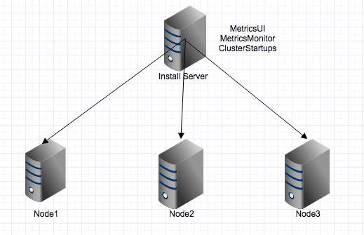

DataPlatformInstaller
=======

> A commandline data platform installer

## Description

* env must set well, for example `ssh` `java` etc.

* current version contains `hadoop`, `zookeeper`, `hbase`, `kafka`, `storm`

* default install `MetricUI` and `MetricMonitor` on install machine

## Graph

> minimum cluster install

## Licence

Apache